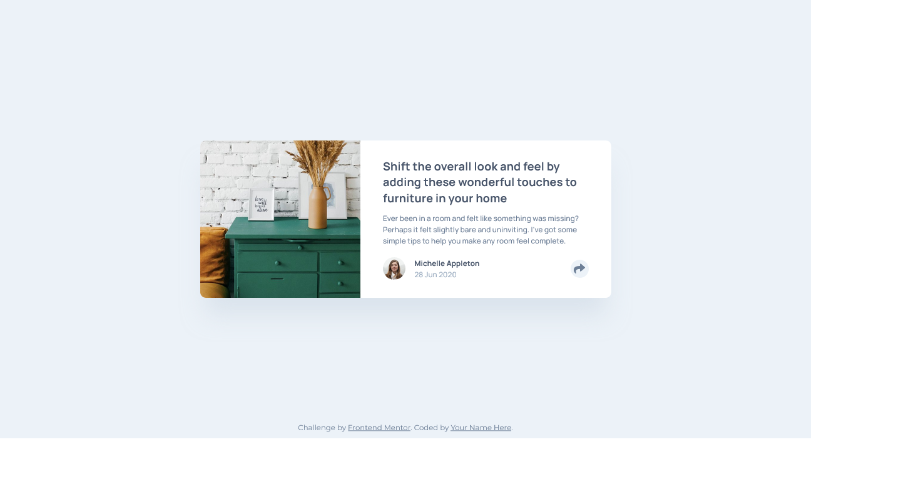
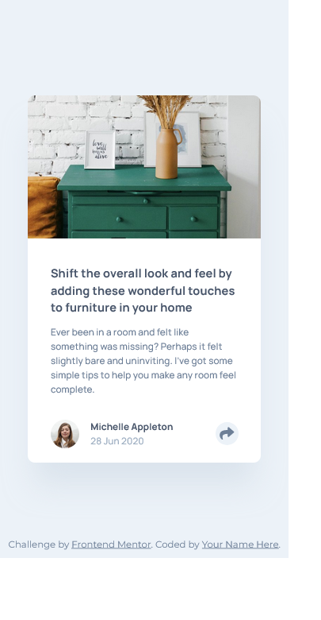

# Frontend Mentor - Article preview component solution

This is a solution to the [Article preview component challenge on Frontend Mentor](https://www.frontendmentor.io/challenges/article-preview-component-dYBN_pYFT). Frontend Mentor challenges help you improve your coding skills by building realistic projects.

## Table of contents

- [Overview](#overview)
  - [The challenge](#the-challenge)
  - [Screenshot](#screenshot)
  - [Links](#links)
- [My process](#my-process)
  - [Built with](#built-with)
  - [Useful resources](#useful-resources)
- [Author](#author)
- [Acknowledgments](#acknowledgments)

## Overview

### The challenge

Users should be able to:

- View the optimal layout for the component depending on their device's screen size
- See the social media share links when they click the share icon

### Screenshot

### Links

- Solution URL: [github](https://github.com/spaprocki/article-preview-component)
- Live Site URL: [netlify](https://spaprocki-article-preview.netlify.app/)

## My process

### Built with

- Semantic HTML5 markup
- CSS custom properties
- Flexbox
- CSS Grid
- Mobile-first workflow
- [px to rem](https://marketplace.visualstudio.com/items?itemName=sainoba.px-to-rem) - VSCode snippet

### Useful resources

- [A modern CSS Reset](https://piccalil.li/blog/a-modern-css-reset/) - This is a reset stylesheet I am planning to use in my following coding projects.
- [Modern Fluid Typography Using CSS Clamp](https://www.smashingmagazine.com/2022/01/modern-fluid-typography-css-clamp/) - This is an amazing article which helped me finally implement CSS Clamp for fluid change of font-size between screen sizes, while mixing rem and vw to express font-size. I'd recommend it to anyone still learning this concept.

## Author

- Website - [spaprocki](https://github.com/spaprocki)
- Frontend Mentor - [@spaprocki](https://www.frontendmentor.io/profile/spaprocki)
